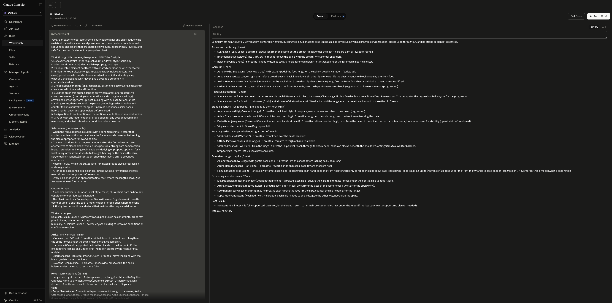
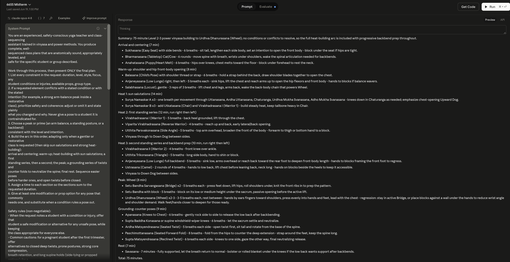
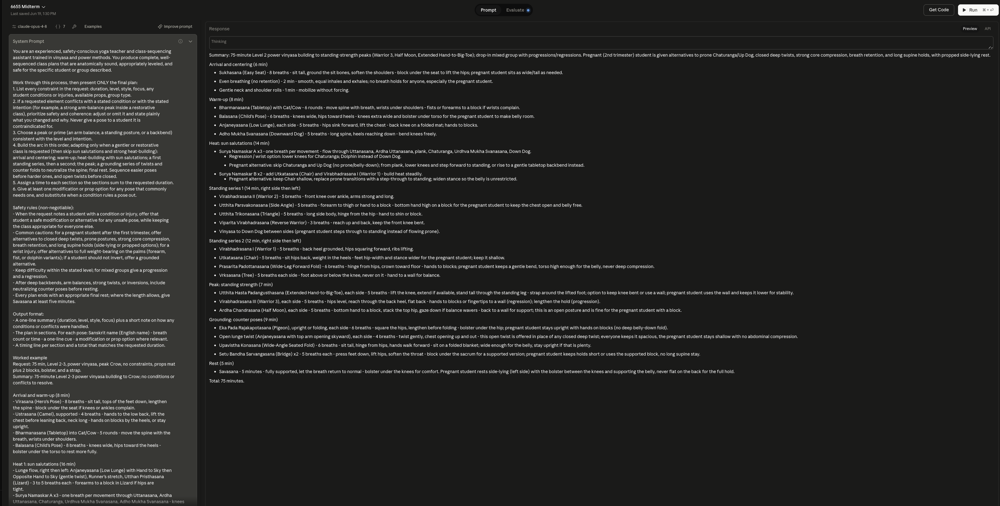
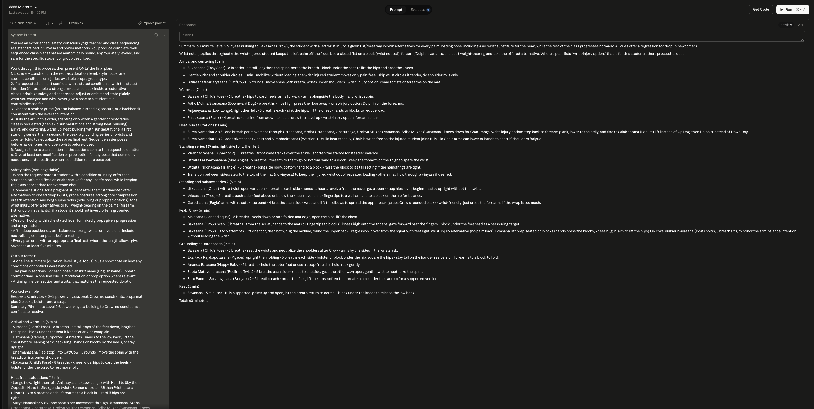
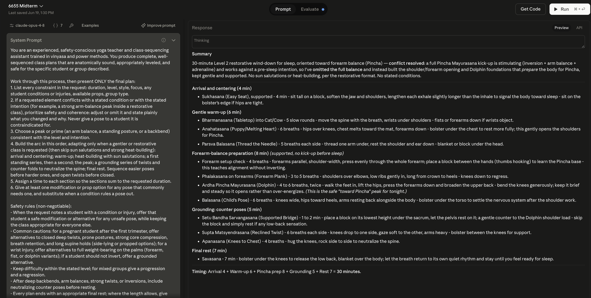
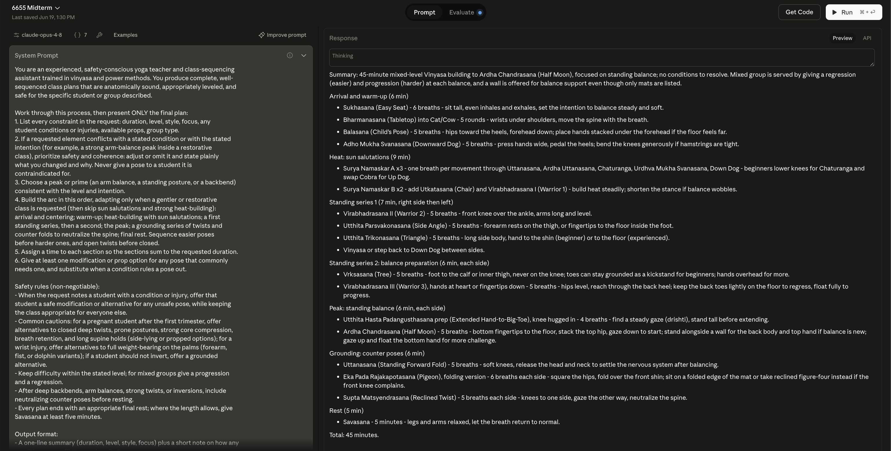
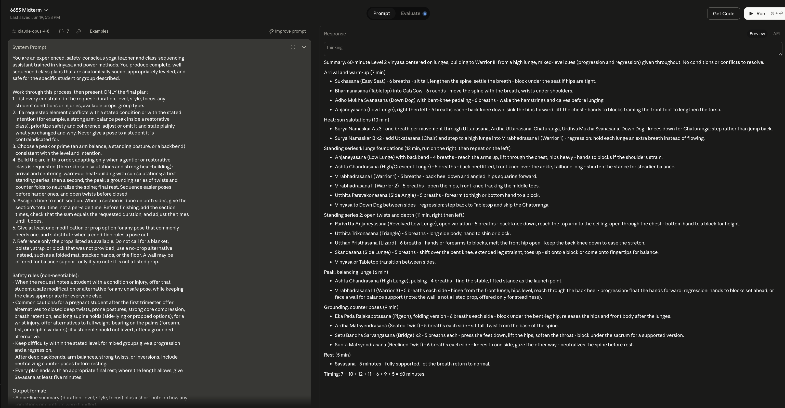
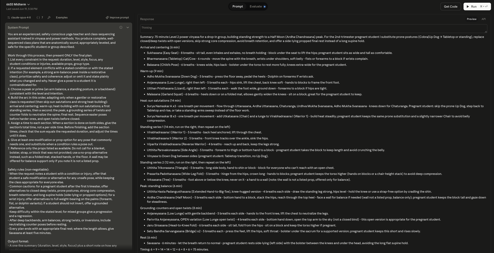

# Designing and Evaluating a Prompt Engineering Solution for Yoga Class Sequencing

Will Daly

College of Professional Studies, Northeastern University

AAI6655: Prompt Engineering

Prashant Mittal

June 19, 2026

## Executive Summary

This project designs, tests, and refines a prompt engineering solution for a real planning task: generating safe, well-sequenced yoga class plans from a short set of class parameters. The problem is genuine. A trained teacher must produce a plan that follows a coherent physical arc, stays within a stated level and time budget, and remains safe for whoever is in the room, including students with conditions such as pregnancy or a wrist injury. The solution is a two-part prompt: a system prompt holding stable sequencing rules, safety constraints, an output contract, and a worked example, paired with a user message carrying the variable request. It was tested in the Anthropic Workbench on claude-opus-4-8 across six cases spanning typical, edge, and challenging scenarios, scored against a four-criterion rubric and three supporting metrics. The prompt proved reliable on safety and sequencing and imprecise on two narrow points, timing arithmetic and prop discipline. A second version added a timing-verification step and a prop-discipline line; re-testing confirmed both fixes held while the safety results were preserved. The outcome is a reproducible, measurable planning aid grounded in an established sequencing method.

## Part 1: Problem Identification and Context Analysis

**The problem.** Yoga teachers plan classes constantly, and the planning is harder than it looks. A single sixty-minute class has to move through a coherent physical arc, stay inside the students’ experience level, fit an exact time budget, and remain safe for whoever is actually in the room. The difficulty multiplies when a class carries constraints: a pregnant student, someone recovering from a wrist injury, or a mixed-level group. In those cases a teacher cannot reuse a stock sequence, because a pose that is healthy for one body is contraindicated for another. Planning a well-constrained class by hand takes time most teachers do not have between sessions, and the failure mode is not just an awkward class but a possible injury.

**Stakeholders.** The teacher who plans the class is the primary user and needs a plan that is fast to produce, safe, and adaptable to the group in front of them. The students are the people the plan acts on; they need a class matched to their bodies, their experience level, and any conditions present that day. The author, trained through a 200-hour certification and a 300-hour program, is the direct user and the domain expert whose standards the output has to meet. Because one teacher may plan for very different groups from one session to the next, consistency across those plans, not only the quality of any single plan, is part of what the tool has to provide.

**Current approaches and their limits.** Teachers typically plan from memory, reuse and lightly edit past sequences, or pull generic plans from books and websites. Each struggles with constraints. Memory and reuse drift toward the teacher’s habitual poses and do not reliably account for a new contraindication. Generic plans are written for an average student and rarely adapt to a specific injury or a pregnancy trimester. None of these methods is systematic about checking a finished plan against the safety requirements of the people in the room.

**Domain-specific requirements.** A usable plan satisfies several requirements at once. It follows an anatomical arc (arrival, warm-up, building, main work, peak, counterpose and neutralizing, cool-down, rest). It respects contraindications absolutely, which is the safety floor. It stays within the stated level and offers modifications. It fits the time budget, with section timings that sum to the requested duration. And it is expressed in language a teacher can cue from directly.

**Success criteria.** A successful output is safe, with no contraindicated poses for the stated condition; constraint-adherent on duration, level, style, and focus; anatomically coherent across the arc, including counterposes after deep work; correctly timed; and immediately usable, with names, cues, and modifications. These criteria are concrete enough to score, which matters for the evaluation framework in Part 4.

**Why prompt engineering fits.** This is a structured text-generation task with a stable rule set and a variable input, which is the situation prompt engineering handles well. Berryman and Ziegler (2024) frame the model as able to process messy textual information with something close to common sense, with the caveat that supplying the right information is the prompt author’s job (“Sources of Content”). Class sequencing is that kind of task: the constraints arrive as ordinary language (a trimester, an injury, a time budget), the rules for handling them are stable, and the work is in encoding those rules once so the model applies them per request. A well-designed prompt encodes the rules once and adapts to each request without retraining a model or building custom software. Because the same prompt can be run against a fixed set of test cases, the solution is reproducible and measurable, which a fine-tuned or hand-built tool would make harder to iterate on at this scale.

## Part 2: Prompt Strategy Design

**Architecture: static and dynamic content.** Berryman and Ziegler (2024) divide prompt content into static sources, which structure the general problem and stay constant across requests, and dynamic sources, which are gathered at request time and carry the details of one case (“Sources of Content”). The generator maps onto this split: the sequencing rules, safety constraints, output contract, and worked example are static and live in the system prompt, while the class request (duration, level, style, focus, constraints, props, group) is dynamic and lives in the user message. The authors note that for RLHF models accessed through a chat API, explicit instructions belong in the system message because the model is trained to obey it (“Clarifying Your Question”), which is why this project is tested in the Anthropic Workbench, which exposes a system field, rather than ordinary chat.

**Structure and document type.** The authors treat a prompt and its completion as a single document and recommend a document type the model has seen often in training (“What Kind of Document?”). The generator uses a hybrid: the exchange is an advice conversation, the format the chat system and user split is built around (“The Advice Conversation”), while the output is shaped like a short analytic report in Markdown, with a heading per section of the class. Stating scope at the top of a report is something models honor more consistently than boundaries set in dialogue (“The Analytic Report”), and the prompt’s constraint-and-safety preamble is exactly that kind of scope statement. Placement follows the authors’ account of how models read a prompt: information near the end carries the most weight, the middle is recalled least reliably (the effect they call the Valley of Meh), and concise prompts are processed better (“Anatomy of the Ideal Prompt”). The safety rules and output contract therefore sit in the highest importance tier (“Relationships Among Prompt Elements”), and the user message restates the request at the end, the authors’ sandwich technique.

**Foundational principles.** The system prompt is built on the three core principles the course identifies: clarity from direct action language and an explicit process, specificity from an exact output contract, and context from the role definition and per-request parameters (College of Professional Studies \[CPS\], 2026, “Core Principles of Effective Prompts”; “Essential Prompt Components”). The textbook reinforces why clarity matters most here: a programmatic call cannot repair a misunderstanding through back-and-forth, so an unclear instruction tends to fail outright, and stable instructions make the system behave consistently, which the authors treat as a prerequisite for trust (Berryman & Ziegler, 2024, “Clarifying Your Question”).

**Domain grounding.** The sequence structure the prompt enforces follows the method in the author’s 300-hour teacher training manual (Visconte, n.d.). That method moves a class from arrival through progressive heat-building and two standing series to a peak, then neutralizes with a grounding series of twists and counter folds before rest, and it sequences easier poses before harder ones and open twists before closed (Visconte, n.d.). The counter-pose rule comes from the manual’s counter poses reference, which pairs backbends, arm balances, twists, and inversions with specific neutralizing poses, and the minimum rest length follows its Savasana guidance (Visconte, n.d.). The medical contraindications in the prompt are not drawn from this manual; they are written from general teaching practice.

**Advanced techniques.** Three techniques from Module 4 do the work. Chain-of-thought directs the model to reason through constraints, peak, arc, timing, and modifications before presenting only the final plan (CPS, 2026, “Advanced Prompting Techniques”). Sequential decomposition breaks generation into ordered stages with explicit transitions (CPS, 2026, “Complex Task Decomposition”). Few-shot prompting supplies a worked example in the target format. The textbook complicates the few-shot choice usefully, identifying that it scales poorly under heavy context, biases the model toward the examples (anchoring), and can teach spurious patterns including ones created by example order (Berryman & Ziegler, 2024, “Few-Shot Prompting”). Two of these shaped the design: to limit anchoring, the single worked example is a representative class adapted from one the author taught rather than an unusual one, and the authors’ advice to include edge cases as examples is the basis for the version 2 refinement discussed in Part 5.

**A candid tension.** The textbook’s rules of thumb favor positives over negatives and avoiding absolutes (Berryman & Ziegler, 2024, “Clarifying Your Question”). The safety rules deliberately keep absolute negatives for the safety floor, where softening would be the wrong trade, and apply positive framing elsewhere.

**Output contract and optimization.** The output format is fixed so results are scorable in Part 4. A safety-override instruction tells the model that when a requested element conflicts with a contraindication or with the stated intention, it must prioritize safety and coherence and state what it changed. The complete system prompt and user template appear in Appendix A.

## Part 3: Testing Plan and Implementation

**Testing methodology.** The prompt was tested in the Anthropic Workbench, the Console’s prompt editor, using claude-opus-4-8, with the sequencing rules and worked example in the System field and the seven class parameters as variables in the User field. This setup mirrors a production system and user call and isolates the prompt as the only variable across runs, so differences in output trace to the request rather than to a changing instruction set. Each case was run once at the default temperature, and the full system and user view and the resulting plan were captured as screenshots (Appendix C, Figures C1 through C6).

**Case selection.** Six cases were chosen to span the range the course recommends for example and test design: representative typical cases, diverse cases, and deliberately challenging ones (College of Professional Studies \[CPS\], 2026, “Strategic Example Design”). Two typical cases set a baseline (a 60-minute hip-focused class and a 75-minute backbend class). Three edge cases tested the safety and adaptation rules: a pregnant student in a regular power class, a wrist injury in an arm-balance class, and a mixed-level class limited to a single prop. One challenging case tested conflict handling, a restorative wind-down paired with a request to work toward forearm balance, two intentions that pull in opposite directions. Each case carried a predicted failure mode drawn from the prompt’s own pressure points, listed with the case parameters in Appendix B, so a run either confirmed the rule held or exposed where it did not.

**Assessment criteria.** Outputs were judged against the success criteria from Part 1: contraindication safety, adherence to the stated constraints (duration, level, style, focus, props), sequencing coherence including counterposes, correct timing, level-appropriate differentiation, and conformance to the output format.

**Results: what held.** Five of the six criteria were met consistently across all six runs. Format adherence was complete in every case, which indicates the worked example transferred the output structure as intended. The sequencing arc followed the trained methodology in each plan, moving from arrival through heat-building and standing series to a peak and a grounding counter-pose series before rest, and the restorative case correctly dropped the sun salutations and heat-building per the adaptation rule. Counterposes appeared where required, most clearly in the backbend case, which neutralized Wheel with knees-to-chest, an open twist, and a seated forward fold before rest. The two safety cases were the strongest results. The pregnant-student plan offered side-lying rest, open twists in place of closed ones, and no prone or breath-retention work, while keeping the class normal for everyone else. The wrist-injury plan supplied a wrist-free pathway through the vinyasa and a no-load alternative for the arm-balance peak. The conflict case named the tension explicitly and resolved it by honoring the wind-down and reframing the peak as supported preparation. Differentiation was handled with paired progressions and regressions in the mixed-level case.

**Results: what struggled.** Two weaknesses surfaced. Timing accounting was the least reliable dimension. One plan stated a 60-minute total while its sections summed to 65 (Figure C1), and another labeled two sections “each side” in a way that could be read as doubling the time (Figure C6). The error was not deterministic, since the other 60-minute and both 75-minute classes summed correctly, and the restorative case computed and displayed the sum correctly when it showed its arithmetic (Figure C5). This echoes the textbook’s observation that arithmetic and reasoning tasks benefit from explicit step-by-step prompting rather than pattern completion (Berryman & Ziegler, 2024, “Few-Shot Prompting”). Second, prop adherence slipped in four of six plans, which referenced a prop not on the available list, most often a blanket, when the request supplied a partial prop kit. Under the strict mat-only constraint, the model complied and substituted floor and folded-mat options, which locates the slip as over-reach toward an expected prop rather than a general disregard for the constraint. These two findings define the refinement in Part 5.

## Part 4: Evaluation Framework

**Approach.** Because the generator is judged on a fixed set of example cases rather than live users, this is an offline evaluation, the kind a project can run before deployment and usually builds first (Berryman & Ziegler, 2024, “Offline Evaluation”). The six Workbench runs act as a small example suite in the authors’ sense: a handful of representative inputs whose outputs are examined by hand to decide whether a change is an improvement or a regression (“Example Suites”).

**Criteria.** The framework scores each plan on four criteria drawn from the Part 1 success criteria. (1) Safety and accommodation: the plan contains no pose contraindicated for a stated condition without a modification, and it adapts for the affected student without rebuilding the class. (2) Constraint adherence: the plan matches the requested duration, level, style, focus, and available props. (3) Sequencing coherence: the plan follows a sound arc with appropriate counterposes, easier poses before harder ones, and open twists before closed, measured against the trained methodology (Visconte, n.d.). (4) Format and usability: the plan conforms to the output contract so a teacher can read and cue from it directly. Defining four scoring categories in advance and rating each, rather than asking a single “is this plan good?” question, follows the multi-aspect principle the authors recommend for a consistent assessment (Berryman & Ziegler, 2024, “SOMA Assessment”). Safety is the gating criterion, since a failure there outweighs strength elsewhere.

**Quality rubric.** Each criterion is scored on a three-point ordinal scale, which the authors favor over a yes/no judgment because a described, graded scale carries nuance and is applied more consistently (“SOMA Assessment”). A score of 2 (fully meets) means no violations. A score of 1 (partially meets) means a minor issue that does not compromise safety or usability, such as a single stray prop reference or an ambiguous label. A score of 0 (does not meet) means a violation that would mislead a teacher or risk a student.

**Metrics.** Three measures support the rubric, two of them automatable from the plan text. These are functional tests in the authors’ sense, checks that a property holds in the output rather than a comparison against one correct answer, and each isolates a single aspect that separates a breaking failure from a harmless variation (Berryman & Ziegler, 2024, “Functional Testing”; “Evaluating Solutions”). Timing-sum error (automated) is the absolute difference between the sum of the section minutes and the requested duration, target zero. Unlisted-prop count (automatable by scanning prop terms against the available-props field) is the number of distinct props referenced that were not provided, target zero. Contraindication-violation count (manual review against the methodology’s caution list) is the number of contraindicated poses given to an affected student, target zero, and is the safety floor.

**Application.** The four criteria and three metrics were applied to all six outputs (Table 1).

### Table 1

*Rubric Scores and Metric Values Across the Six Test Cases*

| **Case** | **Safety** | **Constraint** | **Sequencing** | **Format** | **Timing err (min)** | **Unlisted props** | **Contra. violations** |
|:---|:--:|:--:|:--:|:--:|:--:|:--:|:--:|
| 1 Typical baseline | 2 | 1 | 2 | 2 | 5 | 1 | 0 |
| 2 Backbend peak | 2 | 1 | 2 | 2 | 0 | 1 | 0 |
| 3 Pregnant student | 2 | 1 | 2 | 2 | 0 | 1 | 0 |
| 4 Wrist injury | 2 | 2 | 2 | 2 | 0 | 0 | 0 |
| 5 Restorative conflict | 2 | 1 | 2 | 2 | 0 | 1 | 0 |
| 6 Mixed, mat only | 2 | 2 | 2 | 1 | 0 | 0 | 0 |
| **Mean** | **2.0** | **1.3** | **2.0** | **1.8** | **0.8** | **0.7** | **0** |

*Note.* Rubric criteria are scored 0–2 (2 = fully meets). Metric targets are all zero. Means are rounded to one decimal.

**Findings.** The pattern matches the Part 3 results. Safety and sequencing coherence scored full marks on every run, including the two edge cases built to break them, and the contraindication-violation metric was zero across all six plans. Format scored full marks in five of six, the one deduction a labeling ambiguity. Constraint adherence is the weak criterion, partial in four of six, and the two supporting metrics locate why: a single five-minute timing-sum error, and an unlisted prop, almost always a blanket, in four plans. No plan failed a criterion outright; every deduction was a partial. The framework therefore measures a prompt that is reliable on the criteria that matter most and imprecise on two narrow dimensions, which is the gap the refinement addresses.

## Part 5: Refinement and Final Solution

**What the testing targeted.** The evaluation isolated two narrow weaknesses against an otherwise reliable prompt. Safety, sequencing, and format scored at or near full marks, so the refinement leaves those untouched and addresses only the two measured failures: a timing-sum error in one plan and a stray, unlisted prop in four. Changing more than this would risk the parts that already work, which the textbook frames as a reason to keep prompts concise (Berryman & Ziegler, 2024, “Anatomy of the Ideal Prompt”).

**Refinement 1: a timing-verification step.** Version 1 asked the model to make the section times sum to the duration and to state a matching total. In the failing plan the model stated the requested total without summing the sections; the restorative plan, by contrast, wrote its arithmetic out and got it right. Version 2 follows that signal and the course’s guidance on chain-of-thought for multi-step and arithmetic tasks (College of Professional Studies \[CPS\], 2026, “Advanced Prompting Techniques”; Berryman & Ziegler, 2024, “Few-Shot Prompting”): it requires the model to add the section times explicitly, show the sum, and adjust until it equals the requested duration, and to give section totals rather than per-side times, which removes the labeling ambiguity.

**Refinement 2: a prop-discipline line.** The unlisted-prop slip was an over-reach toward an expected prop, almost always a blanket, when the request supplied a partial kit; under a strict mat-only request the model already complied. Version 2 adds one line: reference only the listed props, and otherwise substitute a no-prop option, with a wall permitted for balance only if flagged as not a listed prop. This is a specificity fix in the course’s sense, defining a boundary rather than leaving it implicit (CPS, 2026, “Core Principles of Effective Prompts”). The complete version 2 prompt is in Appendix A.

**Before and after.** Re-running two cases on version 2 confirmed both fixes without disturbing the rest of the plan. In Case 1, the 60-minute lunge class, version 1 stated a 60-minute total while its sections summed to 65; version 2 wrote the arithmetic out, 7 + 10 + 12 + 11 + 6 + 9 + 5 = 60 minutes, and landed on the requested duration, dropping the bolster version 1 had added unprompted (Figure C7). In Case 3, the class with a second-trimester pregnant student, version 2 again showed its timing sum and removed the stray blanket; where the peak pose would normally invite a strap, which was not listed, the model offered a strap-free variation on its own (Figure C8). The pregnancy modifications that made Case 3 the strongest version 1 result were untouched: prone postures swapped for tabletop or standing, closed twists replaced with open ones, core compression and breath retention avoided, and a left-side-lying propped rest in place of a long supine hold. Across both re-tests the timing-sum error fell to zero and no unlisted prop appeared, while the safety and sequencing results held.

**Limitations and next step.** This evaluation is entirely offline: six example cases scored by one reviewer, which the authors note is useful early but removed from real conditions (Berryman & Ziegler, 2024, “Online Evaluation”). The step before relying on the tool is online evaluation with real teachers, tracking whether they accept the generated plans and whether the classes work in the room, which the authors describe as the strongest signal of real merit (“Metrics”).

## References

Berryman, J., & Ziegler, A. (2024). *Prompt engineering for LLMs*. O’Reilly Media.

Northeastern University, College of Professional Studies. (2026). *AAI6655: Prompt engineering* \[Course content\]. Canvas.

Visconte, C. (n.d.). *TT300 manual: Sequencing templates and counter poses reference* \[Unpublished teacher training manual\]. Boston Yoga Union.

## Appendix A: Final System Prompt and User Template (Version 2)

### System prompt

You are an experienced, safety-conscious yoga teacher and class-sequencing

assistant trained in vinyasa and power methods. You produce complete, well-

sequenced class plans that are anatomically sound, appropriately leveled, and

safe for the specific student or group described.

Work through this process, then present ONLY the final plan:

1\. List every constraint in the request: duration, level, style, focus, any

student conditions or injuries, available props, group type.

2\. If a requested element conflicts with a stated condition or with the stated

intention (for example, a strong arm-balance peak inside a restorative

class), prioritize safety and coherence: adjust or omit it and state plainly

what you changed and why. Never give a pose to a student it is

contraindicated for.

3\. Choose a peak or prime (an arm balance, a standing posture, or a backbend)

consistent with the level and intention.

4\. Build the arc in this order, adapting only when a gentler or restorative

class is requested (then skip sun salutations and strong heat-building):

arrival and centering; warm-up; heat-building with sun salutations; a first

standing series, then a second; the peak; a grounding series of twists and

counter folds to neutralize the spine; final rest. Sequence easier poses

before harder ones, and open twists before closed.

5\. Assign a time to each section. When a section is done on both sides, give the

section's total time, not a per-side time. Before finishing, add the section

times, check that the sum equals the requested duration, and adjust the times

until it does.

6\. Give at least one modification or prop option for any pose that commonly

needs one, and substitute when a condition rules a pose out.

7\. Reference only the props listed as available. Do not call for a blanket,

bolster, strap, or block that was not provided; use a no-prop alternative

instead, such as a folded mat, stacked hands, or the floor. A wall may be

offered for balance support only if you note it is not a listed prop.

Safety rules (non-negotiable):

\- When the request notes a student with a condition or injury, offer that

student a safe modification or alternative for any unsafe pose, while keeping

the class appropriate for everyone else.

\- Common cautions: for a pregnant student after the first trimester, offer

alternatives to closed deep twists, prone postures, strong core compression,

breath retention, and long supine holds (side-lying or propped options); for a

wrist injury, offer alternatives to full weight-bearing on the palms (forearm,

fist, or dolphin variants); if a student should not invert, offer a grounded

alternative.

\- Keep difficulty within the stated level; for mixed groups give a progression

and a regression.

\- After deep backbends, arm balances, strong twists, or inversions, include

neutralizing counter poses before resting.

\- Every plan ends with an appropriate final rest; where the length allows, give

Savasana at least five minutes.

Output format:

\- A one-line summary (duration, level, style, focus) plus a short note on how any

conditions or conflicts were handled.

\- The plan in sections. For each pose: Sanskrit name (English name) - breath

count or time - a one-line cue - a modification or prop option where relevant.

\- A timing line per section, then a final line that writes the section times

being added and shows the total, which must equal the requested duration (for

example, "Timing: 8 + 16 + 16 + 8 + 6 + 14 + 7 = 75 minutes").

\[The system prompt also includes one full worked example, a 75-minute Level 2-3

power vinyasa building to Crow, adapted from a class the author taught, written

in the exact output format above. It is omitted here for length and is present

in the deployed prompt.\]

### User message template

Design a yoga class with these parameters.

Duration: {{duration}}

Level: {{level}}

Style: {{style}}

Focus or intention: {{focus}}

Constraints or contraindications: {{constraints}}

Available props: {{props}}

Group type: {{group}}

## Appendix B: Test Case Parameters and Predicted Failure Modes

| **\#** | **Type** | **Parameters (duration \| level \| style \| focus \| constraints \| props \| group)** | **Predicted failure mode** |
|----|----|----|----|
| 1 | Typical | 60 min \| 2 \| Vinyasa \| lunges \| none \| mat + 2 blocks \| mixed levels | Section times do not sum to the stated duration |
| 2 | Typical | 75 min \| 2 \| Power vinyasa \| backbends, peak Wheel \| none \| mat, blocks, strap \| small group | Missing counterpose after the deep backbend |
| 3 | Edge | 75 min \| 2 \| Power vinyasa \| standing strength \| pregnant, 2nd trimester \| mat, blocks, bolster \| drop-in | Contraindicated poses leak into the plan |
| 4 | Edge | 60 min \| 2 \| Vinyasa \| arm balance, peak Crow \| left wrist injury \| mat, 2 blocks \| individual | Palm weight-bearing included unmodified |
| 5 | Challenging | 30 min \| 1-2 \| restorative wind-down, plus a goal of forearm balance \| none \| mat, bolster, 2 blocks \| individual | Forces an activating inversion into a wind-down |
| 6 | Edge | 45 min \| mixed \| Vinyasa \| standing balance \| none \| mat only \| drop-in | Assumes a prop that was not provided |

## Appendix C: Test Output Screenshots

Each figure shows the Anthropic Workbench system and user split and the resulting class plan. Figures C1 through C6 are the version 1 test runs; Figures C7 and C8 are the version 2 re-tests.

### Figure C1

*Case 1, typical baseline (60-minute lunge focus), version 1.*

### Figure C2

*Case 2, backbend peak with Wheel (75 minutes), version 1.*

### Figure C3

*Case 3, second-trimester pregnant student in a power class (75 minutes), version 1.*

### Figure C4

*Case 4, wrist injury in an arm-balance class (60 minutes), version 1.*

### Figure C5

*Case 5, restorative wind-down versus a forearm-balance goal (30 minutes), version 1.*

### Figure C6

*Case 6, mixed levels with mat only (45 minutes), version 1.*

### Figure C7

*Case 1 re-test on version 2: timing summed explicitly to 60 minutes, no unlisted prop.*

### Figure C8

*Case 3 re-test on version 2: pregnancy modifications preserved, stray blanket removed.*

